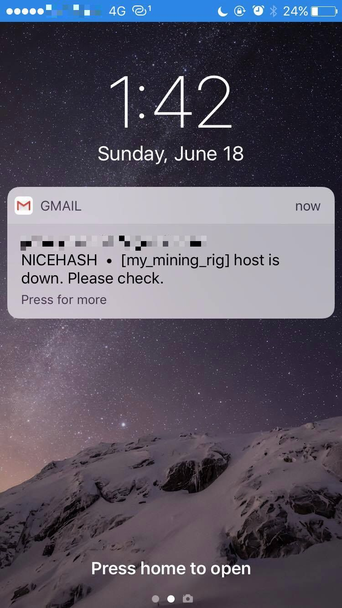
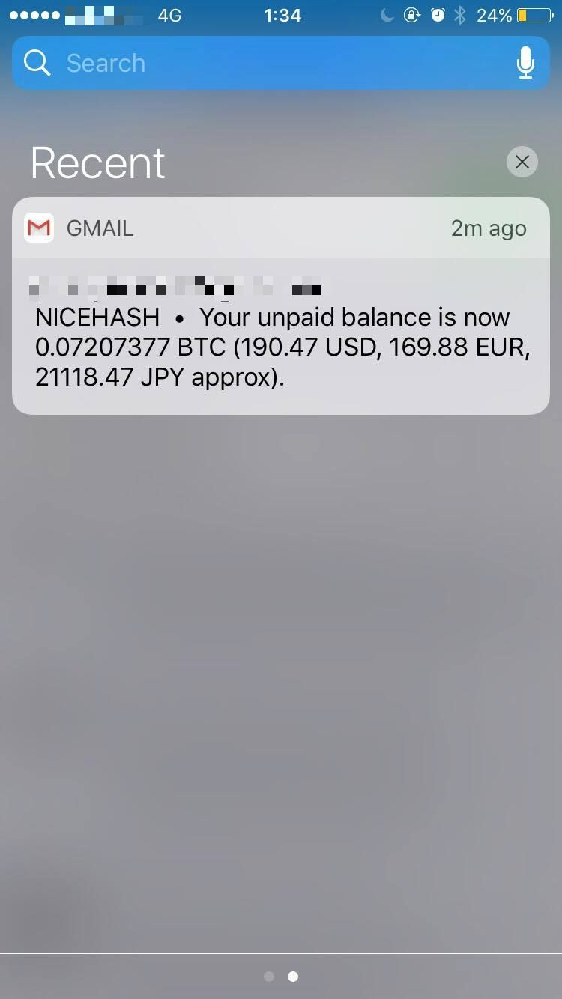

# Nice Hash Monitoring Tools
*Simple NiceHash client to monitor your mining rigs*

  
   <i>NiceHash Logo</i>

## What this tool can do

- [x] Configure alerts via email to be notified whenever one of your mining rig is down.
- [x] Enable BTC unpaid balance reports via email.
- [x] The unpaid balance can be displayed in USD, EUR, JPY or in any other supported currency.

## Examples of Notifications

  
   <i>Notification of when one hostname is down.</i>

__________________________________________________________________________

  
   <i>Balance notification</i>

__________________________________________________________________________

## Donate

If you like this project and want to donate: **1BgEDmdXTsUBgo4ejKXWrFoAdctNc7vncJ (BTC)**
